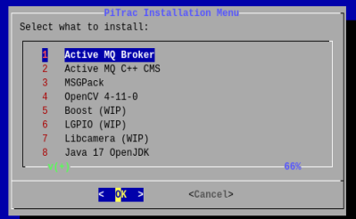

- [Installation and Configuration](#installation-and-configuration)
- [Background Of This Script](#background-of-this-script)
- [Getting Ready](#getting-ready)

## Installation and Configuration

### Background of this script
This script uses Dialog, which should automatically install. This script also requires Internet connectivity to install all the required libraries.

The goal is to facilitate all the required software and configuration. Eventually, making this process a one-click solution for all required PiTrac software and configurations. 

### Getting Ready
Move this entire folder to your user home folder. 

Example: `/home/pitracuser/`

Get installation script ready:  
1. From this project root folder `cp -R Dev /home/pitracuser/`
2. `cd /home/pitracuser/Dev`
3. `chmod +x run.sh`
3. `./run.sh`

You should be able to see the menu screen. 

