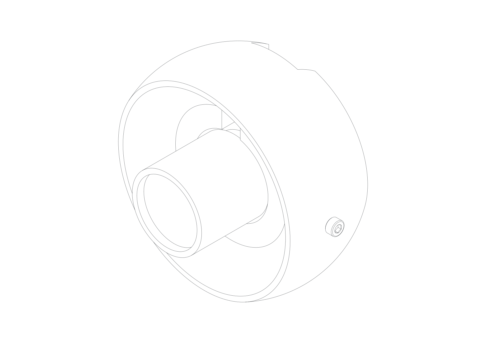
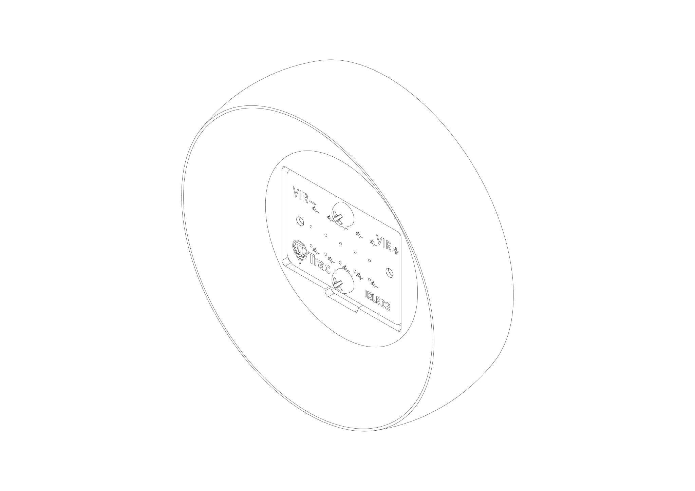
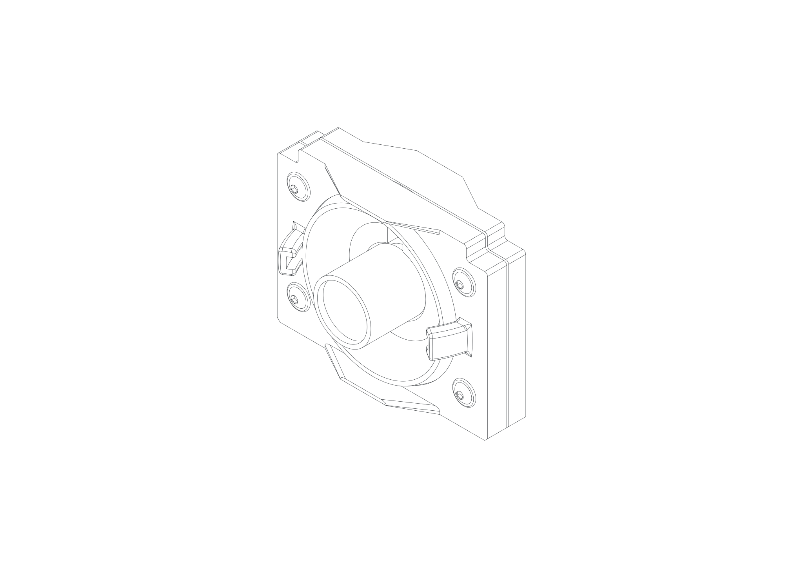
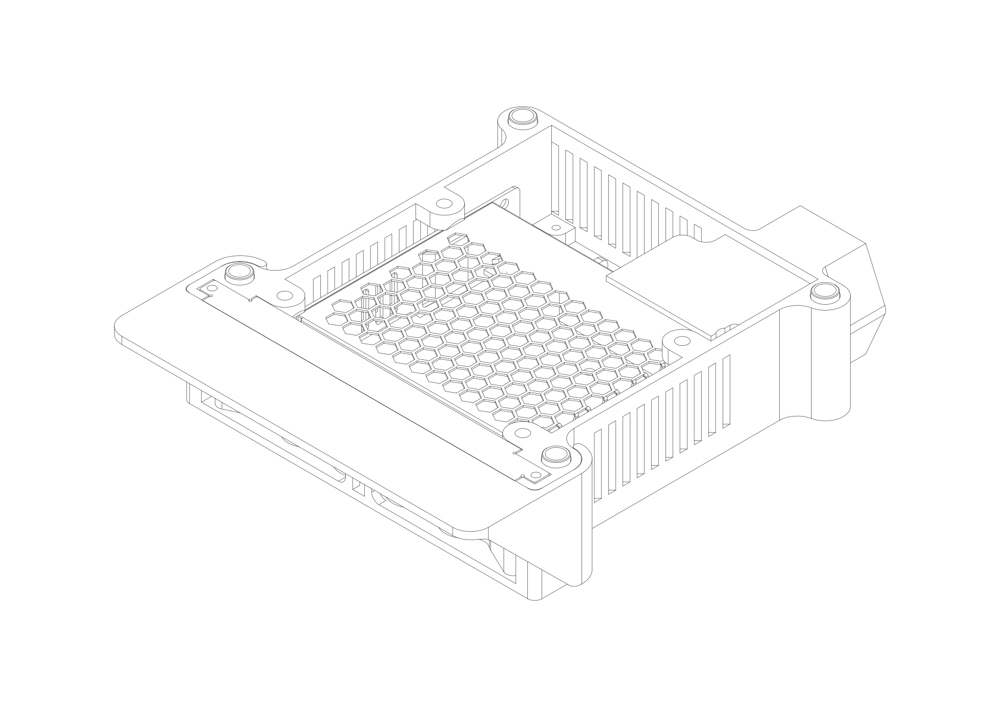
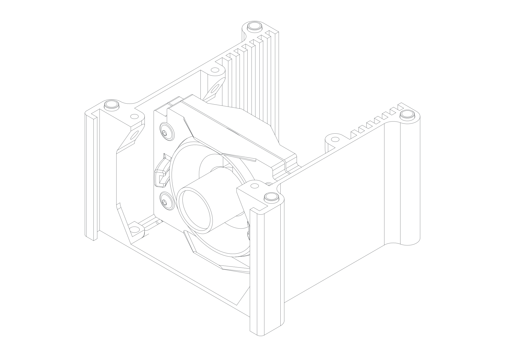
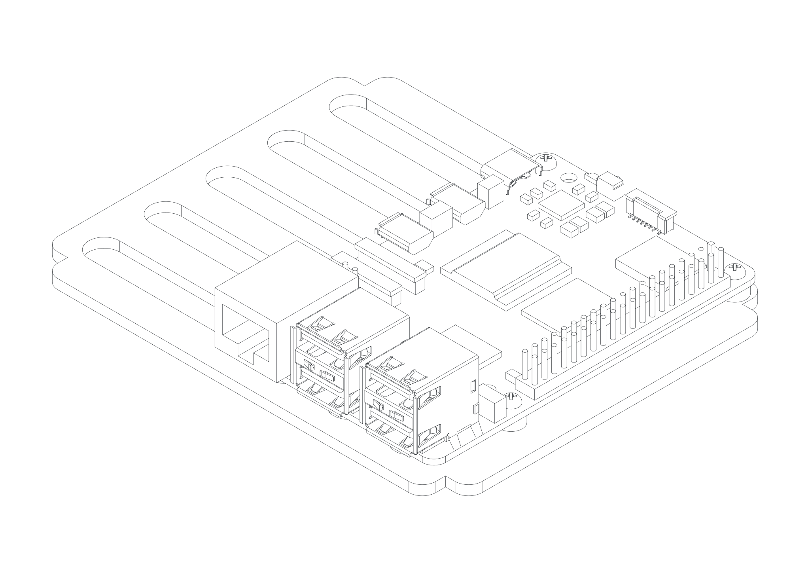
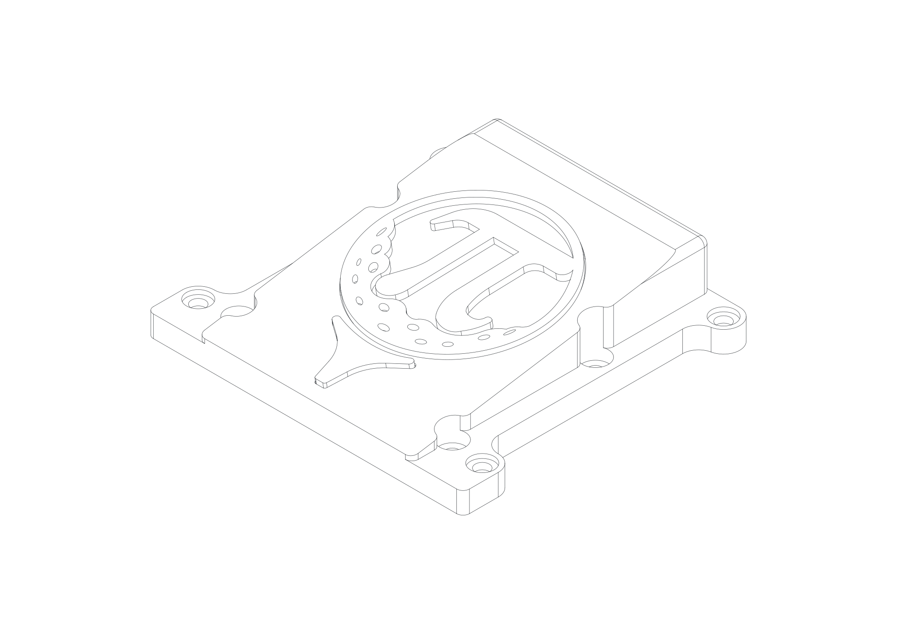
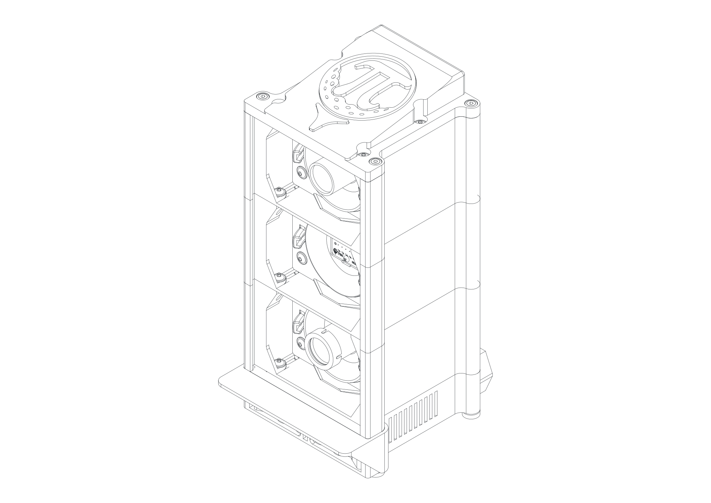

# Enclosure Version 3 / Assembly

---

## Bill Of Material
| Number | Part | Qty | Notes | Link |
|--------|---------|---------|--------|--------|
| **Printed Parts** |||||
| 1 | EyeScreen | 3 | - |- |
| 2 | 5x2IRLED_Eyeball | 1 | - |- |
| 3 | Stack_Module_PSU_vent | 1 | version with less ventilation holes also available |- |
| 4 | Pi5_Carrier_vertical_3mm | 1 | choose height and hole version according to your setup (NVHe, HDMI access...) |- |
| 5 | IMX296-MPI_Eyeball_6mm_camfered | 2 | Print, choose correct variant for your camera |- |
| 6 | Carrier_Clamps | 4 | - |- |
| 7 | ConnectorBoardv3_Carrier | 1 | - |- |
| 8 | Foot | 4 | - |- |
| 9 | LinePower_Cover | 1 | - | - |
| 10 | Stack_Module | 3 | - |- |
| 11 | EyeScreen_Clamp | 3 | - |- |
| 12 | Stack_Module_Cover_forInserts | 1 | Variant/Stack_Module_Cover, if you prefer one simple part |- |
| 13 | Spacer | 16 | - |- |
| 14 | Ambient_LED_Screen | 1 | - | - |
| 15 | IRFilter_Mount_1inchround | 1 | only for 1" round filters, otherwise use mount from ...\3D Printed Parts\Enclosure Version 2\ ...  | - |
| 16 | Calibration Rig| 1 | .../3D Printed Parts/Enclosure Version 3/Part/**Calibration Rig** | - |
| 17 | Stack_Module_Cover_insert | 1 | - | - |
| 18 | Stack_Module_Cover_LogoTee | 1 | - | - |
| 19 | Stack_Module_Cover_LogoBall | 1 | - | - |
| 20 | Ambient_LED_Visor | 1 | - | - |
| **Purchase Parts** |||||
| 1 | Camera| 2 | - |  - |
| 2 | 5x2 IR LED | 1 | or legacy 100 W COB IR LED with 60° Lens + reflector, need legacy 3D printed **LED_Eyeball** and **LED_clamp** | - |
| 4 | Meanwell LRS-75-5 | 1 | - | - |
| 5 | AC Power Inlet C14 with Fuse | 1 | - |  - |
| 6 | USB COB LED Strip Lights 6.56 ft | 1 | roughly 60 cm required; 8mm widht |  - |
| 7 | Wires | 3 | - |  - |
| 8 | Pi5 | 1 | - | - |
| 9 | ConnectorBoardv3 | 1 | - | - |
| 10 | Acrylic Shankshield | 1 | 138 x 264 x 4 mm (or 1/4″) anything within 135-139.5 x 262.5-265 x 3-6.5 mm will work, "museum style" if possible to reduce reflections| - |
| 11 | Acrylic Backplate | 1 | 110 x 267 x 2 mm (or 1/4″) anything within 108-111 x 265-268 x 1.5-3 mm will work;if **Back_Interface_Plate** is used reduce length to 234.5-236.5 (including the D-type Back_Interface-Plate, which will need slighly shorter length because the plate is taller) | - |
| 12 | IR-Pass Filter| 1 | 1" | 1" round or 1" square |
| **Standard Parts** ||||
| 1 | ISO 4032 M5 nut| 20 | only 16 if you opt for sleeve nuts | - |
| 2 | ISO 10511 M5 lock nut| 4 | lock peferred, ISO 4032 will work as well | - |
| 3 | M5 washer | 4 | only if you do not opt for sleeve nuts | - |
| 4 | M5x318 mm rod | 4 | trim to 318 mm for washer and nut assembly; shorter (306 mm) for sleeve nuts | - |
| 5 | ISO 7380-2 M5x10 mm screw| 10 | 10-15 mm, four must be 10 mm; ISO 4762 optional | [-](https://accu-components.com/us/flanged-button-screws/8614-SSBF-M5-10-A2) |
| 6 | ISO 7380-2 M5x15 mm screw| 12 | 10–15 mm; ISO 4762 optional | [-](https://accu-components.com/us/flanged-button-screws/8616-SSBF-M5-14-A2) |
| 7 | ISO 7380-2 M5x20 mm screw| 12 | 20–25 mm; ISO 4762 optional | [-](https://accu-components.com/us/flanged-button-screws/8619-SSBF-M5-20-A2) | 
| 8 | ISO 4762 M5x35 mm screw| 4 | -optional- alternative to the M5 trough rod design | - |  
| 9 | ISO 4762 M3x6 mm screw | 4 | 6–15 mm; cylindrical head | - |
| 10 | M3x6 mm screw | 2 | - | [-](https://tinyurl.com/4y7m4uxr) |
| 11 | M2x10 mm self-tapping screw | 12 | - | [-](https://tinyurl.com/rj8hf3k6) |
| 12 | M3x5 mm self-tapping screw | 8 | - | [-](https://tinyurl.com/rj8hf3k6) |
| 13 | M3x10 mm self-tapping screw | 17 | - | [-](https://tinyurl.com/rj8hf3k6) |
| 14 | M5 x 12 mm sleeve nuts| 4 | provides a more aesthetic assembly | [-](https://tinyurl.com/3srvja7j) |

---

##  General Notes
The design is modular and intended to make it easy to swap between different stack configurations that may be introduced in future versions of the PiTrac Launch Monitor.

As a result, there is some redundancy in the assembly. Each stack provides eight potential connection points: four inner holes used to fasten adjacent stacks together with short M5 screws, and four outer through-holes that allow all stacks to be clamped together at once using threaded rods.

In most cases, using only one of these two fastening methods is sufficient. Threaded rods allow for easier assembly and disassembly, while short screws may be preferable for an initial prototype setup.

For future changes to the overall stack height, the threaded rods may need to be shortened or replaced. If you choose to assemble the stacks using only short M5 screws, please note the M5×35 mm option described in the Stack_Module_PSU assembly section.

The folling assembly instruction might be a hard read, so feel free to watch the video instead:

---

##  Camera Assembly

[Camera Assembly Drawing](../../assets/technicaldrawings/Assy_Camera_Eyeball.svg)

Tools:
- Cross-head screwdriver  
- 2.5 mm Allen key
- Sandpaper (optional) 

| Number | Part | Qty | Notes |
|--------|---------|---------|--------|
| 1 | IMX296-MPI_Eyeball_6mm_camfered | 1 | Remove support material |
| 2 | ISO 4762 M3x6 mm screw | 2 | 6–15 mm; cylindrical head |
| 3 | M2x10 mm self-tapping screw | 4 | 6–12 mm |  
| 4 | Camera| 1 |  |  

1. Remove all support material. 
2. Smooth spherical surfaces if needed.
3. Chamfer/prime the two horizontal holes for **M3×6 mm** using a cross-head screwdriver.
4. Install both **M3×6 mm** screws with the Allen key; ensure straight alignment.
5. Slightly loosen the aperture and focus screws on the **camera**; align them with the slot. The ribbon cable connector must align with the opening.
7. Attach the camera to the **eyeball** using four **M2×10 mm self-tapping screws**.

Note: Choose the apropirate eyeball for your camera and lens.

---

##  LED Assembly (5x2 IR LED board)

[LED Assembly Drawing](../../assets/technicaldrawings/Assy_PiTracIRLED.svg)

Tools:
- Cross-head screwdriver  

| Number | Part | Qty | Notes |
|--------|---------|---------|--------|
| 1 | 5x2IRLED_Eyeball | 1 | - |
| 2 | 5x2 IR LED board | 1 | - |
| 5 | M3x10 mm self-tapping screw | 2 | 8-12 mm |

1. Remove all support material. 
2. Smooth spherical surfaces if needed.
3. Insert the already wired **5x2 IR LED board** in the **5x2IRLED_Eyeball**. Match electric polarity.
4. Install the four **M3x10 mm self-tapping screw**. Do not overtighten.
5. Clip the cables in place and ensure correct polarity. Make sure that the cables are as far apart as possible.

---

##  LED Assembly (legacy 100 W COB, can be skipped if 5x2 IR LED is used)
Tools:
- Cross-head screwdriver  

| Number | Part | Qty | Notes |
|--------|---------|---------|--------|
| 1 | LED_Eyeball | 1 | - |
| 2 | LED_Clamp | 1 | - |
| 3 | 100 W COB IR LED with wires | 1 | - |
| 4 | 60° LED Lens – 44 mm + Reflector | 1 | - |
| 5 | M3x10 mm self-tapping screw | 4 | 8-12 mm |

1. Remove all support material. 
2. Smooth spherical surfaces if needed.
3. Insert the **reflector** in the **LED_Eyeball**.
4. Insert the **COB LED** in the **reflector**.
5. Position the **LED_Clamp** on the **COB LED**. Ensure that the centering pins of the **LED_CLAMP** are engaged with the **COB LED** holes. Ensure that the LED cables are not squished.
6. Install the four **M3x10 mm self-tapping screw**. Do not overtighten. The clamp is designen with clearance, so that the LED is always preloaded.

---

##  Eyeball Assembly

[Flight-Cam Screen Assembly Drawing](../../assets/technicaldrawings/Assy_Flight_Cam.svg)

Tools:
- 3 mm Allen key for ISO 7380-2 or 4 mm for ISO 4762
- Sandpaper (optional) 
- Superglue (optional) 

| Number | Part | Qty | Notes |
|--------|---------|---------|--------|
| 1 | Camera Assembly or LED Assembly | 1 | - |
| 2 | EyeScreen | 1 | - |
| 3 | EyeScreen_Clamp | 1 | - |
| 4 | ISO 4032 M5 nut| 4 | - |
| 5 | ISO 7380-2 M5x20 mm screw| 4 | 20–25 mm; ISO 4762 optional |  

1. Remove support material.
2. Smooth spherical surfaces if needed. 
3. Insert **M5 nuts** into the **EyeScreen_Clamp** pockets (optional: secure with superglue).
4. Insert the **Camera Assembly** or **LED Assembly** into the **EyeScreen**. 
5. Ensure correct orientation: notches must face upwards (toward the ribbon cable).
6. Install the **M5 screws** and tighten only lightly.

Note: ISO 7380-2 button-head screws look nicer and provide more surface contact; ISO 4762 offers better tool access.

---

##  PSU Stack Module Assembly

[PSU Stack Module Assembly Drawing](../../assets/technicaldrawings/Assy_Stack_Module_PSU.svg)
Tools:
- Cross-head screwdriver 
- 3 mm Allen key for ISO 7380-2 or 4 mm for ISO 4762

| Number | Part | Qty | Notes |
|--------|---------|---------|--------|
| 1 | Stack_Module_PSU_vent | 1 | - |
| 2 | Ambient_LED_Screen | 1 | - | 
| 3 | LinePower_Cover | 1 | - | 
| 4 | Ambient_LED_Visor | 1 | - | - |
| 5 | Spacer | 4 | - |
| 6 | Meanwell LRS-75-5 | 1 | - |
| 7 | AC Power Inlet C14 with Fuse | 1 | - | 
| 8 | USB COB LED Strip Lights 6.56 ft | 1 | roughly 60 cm required; 8mm widht | 
| 9 | Wires | 3 | - | 
| 10 | M3x6 mm screw | 2 | 5-6 mm |
| 11 | M3x5 mm self-tapping screw | 4 | 5-6 mm | 
| 12 | M3x10 mm self-tapping screw | 4 | 5-16 mm | 
| 13 | ISO 4762 M5x35 mm screw | 4 | -optional- alternative to the M5 trough rod design | 
| 14 | ISO 10511 M5 lock nut | 4 | -optional- alternative to the M5 trough rod design; lock peferred, ISO 4032 will work as well |

1. Remove support material.
2. Mount the **Meanwell PSU** in the **Stack_Module_PSU_vent** with two **M3x6 mm screws** from the bottom side (in the center of the PSU).
3. Add two **M3x5 mm self-tapping screws** from the top side (in the corners of the PSU). 6 mm screws will also work, but will cause a slight bump in the bottom side surface.
4. Install the three **wires** on the screw terminals of the PSU. It is advised to use the standard color code for PE, L, N (US: G, N, H).
5. Install the **AC Power Inlet** in the **Stack_Module_PSU_vent** and plug in the wires on the right terminals. Fix the **AC Power Inlet** with two **M3x10 mm self-tapping screw**.
6. Get familiar with the right orientation of the **Ambient_LED_Screen** in the **Stack_Module_PSU_vent**.
7. Wrap the **USB COB LED Strip** on the **Ambient_LED_Screen**. Start in the lower left corner with roughly 2 cm after the USB cable. Stick the COB on the surface going horizontally rightwards. Wrap it arround the corner. Go diagonally upwars so you meet the first wrap on the left side. trim the Strip roughly 2 cm after the last front face wrap. The result should be four horizontal strips in the front and three diagonal ones in the back.
8. Install the wrapped **Ambient_LED_Screen** in the **Stack_Module_PSU_vent**. First thread the USB cable trough the left gap between housing and PSU. Stick the Screen in the slot and secure it with two **M3x10 mm self-tapping screws**.
9. Double check correct wiring and install the **LinePower_Cover** with two **M3x5 mm self-tapping screw**.
10. Slide on or clip on the **Ambient_LED_Visor**.
11. Place **spacers** in the four outermost holes on top.

Note: This stack module is specifically designed for the Meanwell LRS-75-5. It is not recommended to use a different PSU.  
Note: Four ISO 4762 M5x35 mm screws can be used in the Stack_Module_PSU if you do not want to opt for the trough rod variant. Insert four ISO 10511 M5 lock nuts in the base and install the four ISO 4762 M5x35 mm screws from the top.

---

##  Camera Stack Module Assembly

[Flight Camera Stack Module Assembly Drawing](../../assets/technicaldrawings/Assy_Stack_Module_Flight_Cam.svg)

Tools:
- 3 mm Allen key for ISO 7380-2 or 4 mm for ISO 4762

| Number | Part | Qty | Notes |
|--------|---------|---------|--------|
| 1 | Camera Screen Assembly | 1 | - |
| 2 | Stack_Module | 1 | - |
| 3 | Spacer | 4 | - |
| 4 | IRFilter_Mount_1inchround  | 1 | alternative square design from V2 Enclosure, only for flight cam |
| 5 | ISO 7380-2 M5x10 mm screw | 2 | 10–15 mm; ISO 4762 optional | 
| 6 | IR-Pass Filter| 1 | 1" | 1" round or 1" square, only for flight cam | 

1. Remove support material.
2. Pre-tap the lower **EyeScreen** holes with a screw.
3. Mount the **Camera Screen Assembly** to the **Stack_Module**. Recommended front-plane distance: 30 mm (same left/right).
4. Place **spacers** in the four outermost holes on top.
5. Only for the flight camera:  Place **IR-Pass Filter** onto the lens and clip **IRFilter_Mount_1inchround** on the lens. (Process may vary)

---

##  LED Stack Module Assembly

Tools:
- 3 mm Allen key for ISO 7380-2 or 4 mm for ISO 4762

| Number | Part | Qty | Notes |
|--------|---------|---------|--------|
| 1 | LED Screen Assembly | 1 | - |
| 2 | Stack_Module | 1 | - |
| 3 | Spacer | 4 | - |
| 4 | ISO 7380-2 M5x10 mm screw| 2 | 10–15 mm; ISO 4762 optional | 

1. Remove support material.
2. Pre-tap the lower **EyeScreen** holes with a screw.
3. Mount the **LED Screen Assembly** to the **Stack_Module**. Recommended front-plane distance: 30 mm (same left/right).
4. Place **spacers** in the four outermost holes on top.

---

##  Electronics

[Pi5 Assembly Drawing](../../assets/technicaldrawings/Assy_RaspberryPi5_carrier.svg)

[V3Connector Board Assembly Drawing](../../assets/technicaldrawings/Assy_V3Connector_Board.svg)

Tools:
- Cross-head screwdriver 

| Number | Part | Qty | Notes |
|--------|---------|---------|--------|
| 1 | Pi5_Carrier_vertical_3mm | 1 | choose height and hole version according to your setup (NVHe, HDMI access...) |
| 2 | ConnectorBoardv3_Carrier | 1 | - |
| 3 | Pi5 | 1 | - |
| 4 | ConnectorBoardv3 | 1 | - |
| 5 | M3x10 mm self-tapping screw | 4 | - |
| 6 | M2x10 mm self-tapping screw | 4 | alternative: M2.5 screws + risers, for trough hole variant |

1. Mount the **ConnectorBoardv3** on its carrier with four **M3x10 mm self-tapping screws**.
2. Mount the **Pi5** on its carrier with four **M2x10 mm self-tapping screws**. Ensure right orientation: The SD card should align with the opening.

Note: there are alternative **Pi5** mounts available. This version is meant for wireless Pi access only. If you need to access the pi with USB, Ethernet or HDMI regularly, it is recommended to print and use \Enclosure Version 3\Part\Print\Variants\Pi5_Bagpack, _top and _bottom. This will require additional cuts to the **Acrylic backplate**.

If you only need Ethernet access, there are **Back_Interface_Plate** versions available. This will require additional cuts to the **Acrylic backplate**.

Note: this assembly state is a good point to fire up the PiTrac for the first time as all parts are easily accessible.

---

##  Cover assembly

[Cover Assembly Drawing](../../assets/technicaldrawings/Assy_Stack_Module_Cover_forInserts.svg)

Tools:
- Cross-head screwdriver 

| Number | Part | Qty | Notes |
|--------|---------|---------|--------|
| 1 | Stack_Module_Cover_forInserts | 1 | - |
| 2 | Stack_Module_Cover_insert | 1 | - | 
| 3 | Stack_Module_Cover_LogoTee | 1 | - | 
| 4 | Stack_Module_Cover_LogoBall | 1 | - | 
| 5 | M3x5 mm self-tapping screw | 4 | - |
| 6 | M3x10 mm self-tapping screw | 5 | - |

1. Place and twist the **Stack_Module_Cover_insert** into the **Stack_Module_Cover_forInserts**. Ensure correct orientation
2. Push the **Stack_Module_Cover_LogoTee** in the **Stack_Module_Cover_forInserts**. Secure with a **M3x10 mm self-tapping screw** from below.
3. Push the **Stack_Module_Cover_LogoBall** in the **Stack_Module_Cover_insert**. Secure with four **M3x10 mm self-tapping screw** from below.
4. Ensure the logo sits flush and is not rotated. Clamp down the **Stack_Module_Cover_insert** slightly with four **M3x5 mm self-tapping screw** from below.

Note: There are alternative **Stack_Module_Cover** available, providing a less complex and material intensive print.

---

##  Stack Module to Stack Module Assembly

[PiTrac Assembly Drawing](../../assets/technicaldrawings/Assy_PiTrac.svg) 

Tools:
- 3 mm or 4 mm Allen key (ball-end preferred)

| Number | Part | Qty | Notes |
|--------|---------|---------|--------|
| 1 | Camera Stack Module Assembly | 2 | - |
| 2 | LED Stack Module Assembly | 1 | - |
| 3 | PSU Stack Module Assembly | 1 | - |
| 4 | ISO 7380-2 M5x15 mm screw | 8 | 10–15 mm; ISO 4762 optional | 
| 5 | ISO 7380-2 M5x10 mm screw | 4 | 10 mm; ISO 4762 optional | 

**2nd on 1st stack**
1. Pre-tap the upper **Stack_Module** holes.
2. Mount the **Camera Stack Module Assembly** with 4× M5×10 mm screws.
WARNING: Use 10 mm screws only to ensure clearance above the **PSU**.

**3rd on 2nd stack**
1. Pre-tap the upper **Stack_Module** holes.
2. Mount the **LED Stack Module Assembly** with 4× M5×15 mm screws.

**4th on 3rd stack**
1. Pre-tap the upper **Stack_Module** holes.
2. Mount the **Camera Stack Module Assembly** with 4× M5×15 mm screws. 

---

##  Electronics installation
Tools:
-

| Number | Part | Qty | Notes |
|--------|---------|---------|--------|
| 1 | Pi5 Assembly | 1 | choose height and hole version according to your setup (NVHe, HDMI access...) |
| 2 | ConnectorBoardv3 Assembly | 1 | - |
| 3 | Carrier_Clamps | 4 | - |

1. Slide the **ConnectorBoardv3 assembly** in the inner most slot and attach the Powersupply wires. Input terminals should face downwards toward the powersupply.
2. Plug in the USB cable from the LED strip and the USB C cable for the raspberry pi.
3. Connect the LED wires to the connector board terminals. Clip the cables in the **ConnectorBoardv3_Carrier** to ensure maximal distance between + and - wires.
4. Install the dupont-connector wires for the connector board.
5. Pinch the carrier clamps with two fingers and place them below and above the **ConnectorBoardv3 assembly** to fix its position. Ideally the board sits between the first and second stack.
6. Slide in the **Pi5 assembly** in the inner most slot. Optional: can be positioned in the small pocket behind the inner most slot for a static / non movable position.
7. Connect the USB-C powersupply, both camera ribbon cables, and the dupont-connector wires from the connector board and fligth cam to the Pi5.
8. Pinch the carrier clamps with two fingers and place them below and above the **Pi5 assembly** to fix its position. Ideally the board sits in the upper most stack.
9. Visually inspect the wiring. All cables in the right terminals? Nothing pinched or squeezed? Sufficient spacing between the LED cables?

Note: there are alternative **Pi5** mounts available. This version is meant for wireless Pi access only. If you need to access the pi with wires regularly, it is recommended to print and use \Enclosure Version 3\Part\Print\Variants\Pi5_Bagpack, _top and _bottom. This will require additional cuts to the **Acrylic backplate**.
Note: this assembly state is a good point to fire up the PiTrac for the first time as all parts are easily accessible.

---

##  Cover installation

Tools:
- 3 mm Allen key for ISO 7380-2 or 4 mm for ISO 4762
- Saw for trimming the M5 rods
- File for deburring

| Number | Part | Qty | Notes |
|--------|---------|---------|--------|
| 1 | Stack_Module_Cover_forInserts assembly | 1 | - |
| 2 | M5 x 12 mm sleeve nut | 4 | - |
| 3 | ISO 4032 M5 nut | 4 | alternative to sleeve nuts |
| 4 | ISO 10511 M5 lock nut | 4 | lock peferred, ISO 4032 will work as well |
| 5 | M5x306 mm rod | 4 | trim to 306 mm, or longer (318 mm) for normal nuts |
| 6 | Spacer | 4 | - |
| 7 | M5 washer | 4 | alternative to sleeve nuts |
| 8 | ISO 7380-2 M5x15 mm screw| 4 | 10–15 mm; ISO 4762 optional | 
| 9 | Acrylic Shankshield | 1 | - |
| 10 | Acrylic Backplate | 1 | - |

**Stack_Module_Cover on 4th stack**
1. Pre-tap the upper **Stack_Module** holes.
2. Insert four spacers into the **Camera Stack Module Assembly** (for alignment).
3. Mount the **Stack_Module_Cover** with **4× M5×15 mm screws**.
4. Slide in the **Acrylic Shankshield** and **Acrylic Backplate**.
5. Cut **rods** to 306 mm and deburr. (318 mm optional)
6. Thread **ISO 10511 M5 lock nuts** onto the **rods** and insert them from below into the **PSU Stack Module** (nuts must seat in the hex pockets).
7. Ensure the rods stand out ~ 2mm at the bottom of the **PSU Stack Module**.
8. Install **sleeve nuts** on the top end at the **Stack_Module_Cover**.
or:
8. Install washers and nuts on the top end at the **Stack_Module_Cover**.

Note: Sleeve nuts on the cover are more aesthetic. --> needs shorter rods  
Note: Alternative to the M5 rods, just four ISO 4762 M5x35 mm screws can be used in the Stack_Module_PSU. (more for a protype setup where regular disassembly is expected)

---

##  Feet

Tools:
- Superglue  

| Number | Part | Qty | Notes |
|--------|---------|---------|--------|
| 1 | Foot | 4 | - |
| 2 | ISO 4032 M5 nut | 4 | - |

1. Glue the nuts into the **feet**.
2. Wait for the glue to be fully cured.
3. Thread the **feet** onto the M5 rods of the full assembly. Turn them all the way up and adjust as needed.
