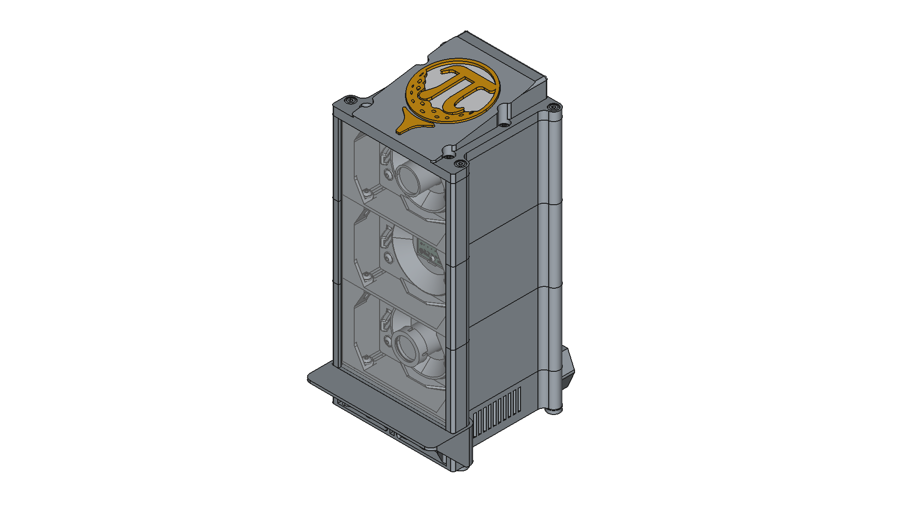
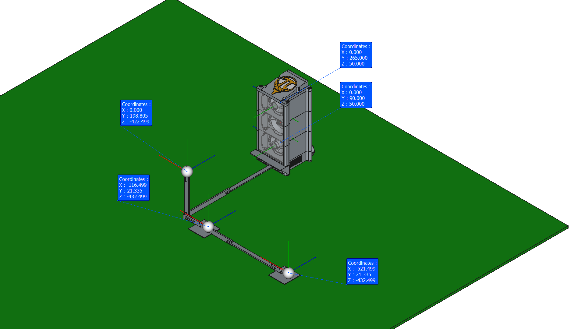

# Enclosure Version 3 Overview


Folder overview:  

```
Enclosure Version 3/
├─ README.md          # Overview, Safety Disclaimer, Requirements
├─ Assembly/          # FreeCAD Assembly files
│  ├─ README.md       # Assembly instruction
   └─ Assembly4/      # .FCStd and .svg assembly files
├─ Assets/            # general supporting material
│  └─ Part Pictures/  # Images for buildplate-orientation
└─ Part/
   ├─ README.md       # Parts overview and printing instruction
   ├─ Misc/           # .FCStd files for  CAD supporting material
   ├─ Calibration Rig/# .stl, .stp and .FCStd files for the calibration rig
   ├─ Purchase/       # .stp and .FCStd files for purchased parts
   └─ Print/          # .stl, .stp and .FCStd files for preferred design
      ├─ Legacy/      # .stl, .stp and .FCStd files for legacy parts
      └─ Variants/    # .stl, .stp and .FCStd files for design variants and mods.
         └─ Archive/  # .stl, .stp and .FCStd files for depreceated parts, likely to be deleted soon

```

---

## Software

- FeeCAD v1.0.2, designed mainly in the Part Design Workbench
- Fasteners v0.5.44, for standard parts in the Assembly
- Assembly4 v0.60.6, for the Assembly files

---

## Safety Disclaimer

**Important:** These 3D-printed parts are designed to house components connected to mains voltage (100–240V AC). Please observe the following safety precautions:

- Only place the assembled unit on a **stable, non-flammable surface**.  
- Never leave the unit **powered on and unattended**.  
- Keep out of reach of **children and pets**.  
- Ensure proper **ventilation** around the power supply to avoid overheating. (not bedded into artificial turf)  
- Handle electrical connections **carefully** and only if you are confident with mains electricity.  
- Avoid **cable damage**: do not pinch wires or run them over sharp edges.  
- Use proper **fuses or circuit protection** in the IEC connector.  
- Always verify **correct polarity and connections** before powering on.  
- **Material choice matters**: PLA is flammable; consider PETG or ABS for better heat resistance, ideally UL94 V-0 certified.  
- Ensure **print quality**: no gaps or thin walls that could expose live components.  
- Do not operate the unit in **wet or humid environments**.  
- Keep all small parts **secure and away from children or pets**.  
- Use **appropriate tools** for assembly and avoid sharp edges.  
- Clearly **mark modules and polarity** where relevant to prevent mistakes.
- Take care not to **drop screws or other components** into the power supply during assembly.
- Always install the **LinePower_Cover.stl** to minimize the risk of electric shock.

Failure to follow these precautions can result in **fire, electric shock, or personal injury**. Print and use these parts at your own risk.  

---

## Main Informations

Calibration coordinates for the calibration rig:  
Camera1 (tee - far back / long rig)  
  X: "-0.522" m  
  Y: "-0.241" m  
  Z: "0.483" m  
```
["-0.522", "-0.241", "0.483"]
```  
Camera1 (tee - near / short rig)  
  X: "-0.117" m  
  Y: "-0.241" m  
  Z: "0.483" m  
```
["-0.117", "-0.241", "0.483"]
``` 
Camera2 (flight)  
  X: "0" m  
  Y: "0.109" m  
  Z: "0.473" m  
```
["0", "0.109", "0.473"]
```  
Assumtion: eyeball screen to front plane has a Z-distance of  30 mm (acc. to the assembly readme and drawings)  

---

## Requirements & Design Checklist

| Entry | Category        | Requirement                                           | Detail                                                                 | Design-Action                                                                                                                                                          | Status |
|------:|-----------------|--------------------------------------------------------|------------------------------------------------------------------------|-----------------------------------------------------------------------------------------------------------------------------------------------------------------|--------|
| 1 | Structure | Adjustable feet | for leveling | M5 nut in foot, nominal is completely in, allows for a few mm adjustment | done |
| 2 | Optics | Reference interface to calibration rig | already established in V2 design | pocket in Stack_Module_PSU | done |
| 3 | Safety | UL94 V0 flame retardant filament | DIY PCB, mains voltage, high power LED, long runtimes | Cannot be controlled; pointed out in documentation / housing; *Do not leave unattended* label | - |
| 4 | Safety | IP40 IEC 60529 protection (ideally) | no fingers or tools should access critical areas | Rather IP20; all mains cables covered; no ventilation holes >5 mm near PSU; mains voltage not accessible → maybe IP40-ish | done |
| 5 | Safety | DIN VDE 0100 / 0701–0702 | min. 3 mm airgap, 5 mm structural gap on mains voltage | Safety margin between PSU and power socket for cables and airgaps | done |
| 6 | Safety | Cable strain relief | — | Not relevant for PSU due to housing design; peripheral and Pi cables uncritical | done |
| 7 | Safety | Ventilation holes (see IP40) | — | Holes in Stack_Module_PSU and Stack_Module_Cover | done |
| 8 | Safety | Mains voltage label | — | Already written on purchased power socket | done |
| 9 | Compatibility | Max footprint 175 × 175 mm | for small printers (e.g. Prusa Mini) | Largest part: 160 × 148 × 87.5 mm; room for brim or skirts | done |
|10 | Compatibility | 2× Pi 4 with heatsink | — | 100 × 265 × 32 mm electronics space; USB cables may be limiting | done |
|11 | Compatibility | 2× Pi 5 with heatsink | — | 100 × 265 × 32 mm electronics space; USB cables may be limiting | done |
|12 | Compatibility | V1–V3 PCB clearance | — | V2mod and V3 tested | done |
|13 | Compatibility | Compute Module | No longer applicable | — | — |
|14 | Compatibility | Further cameras | — | — | — |
|15 | Compatibility | Display | LCD / Pi display; HDMI interface required instead of Stack_Module_Cover | - | pending |
|16 | Compatibility | Innomaker Cam | — | IMX296-MPI Eyeball, 6 mm | done |
|17 | Compatibility | Pi Cam | — | PiCam Eyeball, 6 mm, 2.8 mm | done |
|18 | Compatibility | Different lenses | — | Tested with 6 mm; 2.8 mm wide-angle designed | done |
|19 | General | Pleasant to the eyes | — | Looks fine | done |
|20 | Structure | Short BOM | — | Multipurpose parts: stack modules, screens, clamps | done |
|21 | Structure | Easy assembly | — | To be confirmed by community | — |
|22 | Optics | Adjustable cameras (pan/tilt) | — | Pan ±30°, tilt ±20°; suitable for long calibration rig; field of view likely obstructed for wideangle + full pan setup | done |
|23 | Optics | Adjustable LED (pan/tilt) | — | Pan/tilt up to 30°; mostly unnecessary | done |
|24 | Thermal | Free airflow for hot components | — | Ventilation holes bottom + outlet in cover (TBC); ventilated Stack_Module_PSU available | — |
|25 | Optics | Stray light (shank shield) | reflections seen on one build | One-piece or 3-piece shield with separators; flush edges | done |
|26 | Compatibility | Cam1–Cam2 relative position | close to V2 | X within a few mm | done |
|27 | Compatibility | Floor–Cam2 position | close to V2 | X within a few mm; Z differs most | done |
|28 | Structure | Thread inserts optional | — | No inserts needed | done |
|29 | Optics | Rotation point at nodal point | — | Eyeball flange positions camera at rotation center; camera+lens specific | done |
|30 | Compatibility | Designed in FreeCAD | open source / GitHub / .stl, .stp and .FCStd | .stl, .stp and .FCStd available | done |
|31 | Compatibility | Parametric design | where relevant |  | On hold  |
|32 | Cost | ≤ 1 kg filament | secondary priority | ~1.3 kg | failed |
|33 | General | PiTrac logo | — | Large logo in Stack_Module_Cover; monochrome or insert available | done |
|34 | Safety | PSU housing wall thickness | — | 3 mm | done |
|35 | Liability | No official labels | no CE implication | — | done |
|36 | Compatibility | LED strip traces | — | Ambient_LED_Screen supports LED strip | done |
|37 | Structure | Shank shield thickness | 3/16″ or 1/4″ | 7 mm slot; 1/4″ fits; 3/16″ may need spacer | done |
|38 | Compatibility | Metric & imperial screws | — | Currently metric only | — |
|39 | Compatibility | Pi 5 with NVMe | — | Pi5_Carrier_3mmTroughHole: NVMe below Pi + brass studs | done |
|40 | Compatibility | External USB & HDMI | Requires inverted Pi carrier (Bagpack style) | validation pending | done |
|41 | Thermal | Optional fan in cover | Fan in Stack_Module_Cover |  | On hold  |
|42 | Optics | Ring light for camera 1 | Adafruit #4433  | | On hold  |
|43 | Optics | Single COB LEDs (camera 1) | instead of LED strip; Focused illumination; avoid blinding  | | pending |
|44 | Compatibility | Battery pack instead of PSU | Li-ion pack with power management |  | On hold |
|45 | Compatibility | Status LEDs | RGB / NeoPixel-style indicators in cover | Design prepared with "Stack_Module_Cover_Insert, LED hw/sw integration pending | pending |
|46 | Compatibility | Conventional camera mounts | Similar to V2 design for more adjustability | pan-tilt design in .../Variants | done |
|47 | Compatibility | Fixed camera screens | Will allow for bigger field of view; saves material; only when a common best practice is established; lefty/righty specific |  | pending |
|48 | Compatibility | Off center eyeball_screens | To allow for a bigger pan for fast balls; lefty/righty specific |  | pending |
|49 | Compatibility | V3 Carrier | wire seperator for LED to avoid interference | design includes cable clips to sperate wires | done |
|50 | Optics | LED Anti glare | visor for the ambient LED screen| Ambient_LED_Visor.stl | done |
