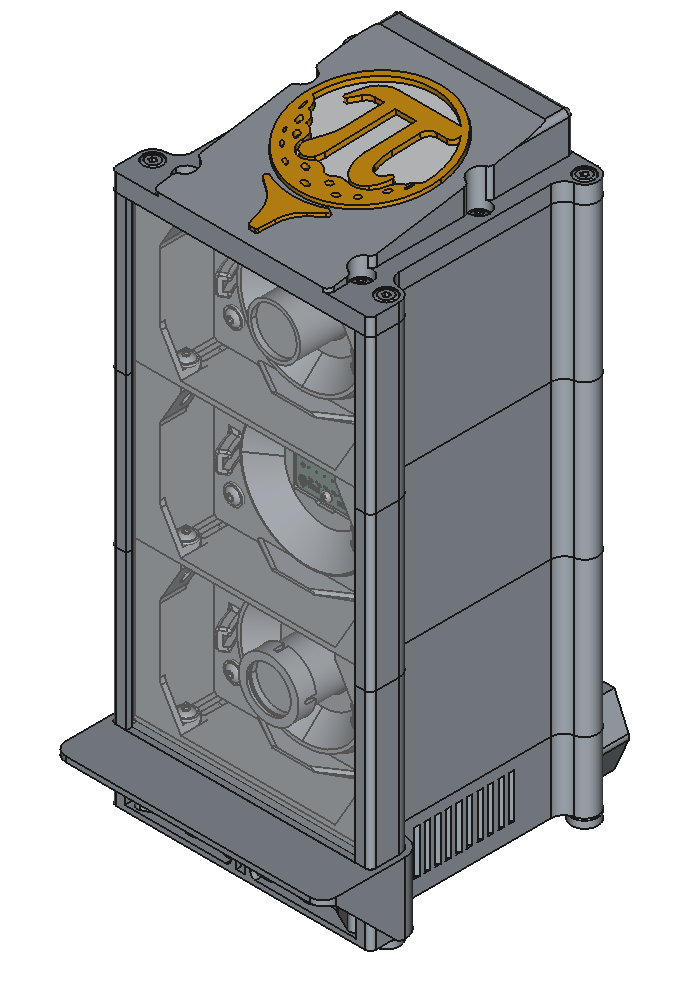

# Hardware

This section covers all the physical components you'll need to build PiTrac, from individual parts to complete assembly guides.

## What you'll find here:

- **[Parts List]()** - Complete list of components and supplies needed
- **[Assembly Guide]()** - Step-by-step instructions for building the V1 enclosure
- **[3D Printing]()** - Guide to printing the V1 and V2 enclosure components
- **[PCB Assembly]()** - Instructions for building the connector and led boards
- **[V3 Enclosure Print and Assembly]()** - Instructions for printing and assembly of the V3 Enclosure

  

    <strong>V1</strong> 
    
  

  

    <strong>V2</strong> 
    
  

  

    <strong>V3</strong> 
    
  

Before ordering parts, make sure to check the [Roadmap]() to understand which version you should build.